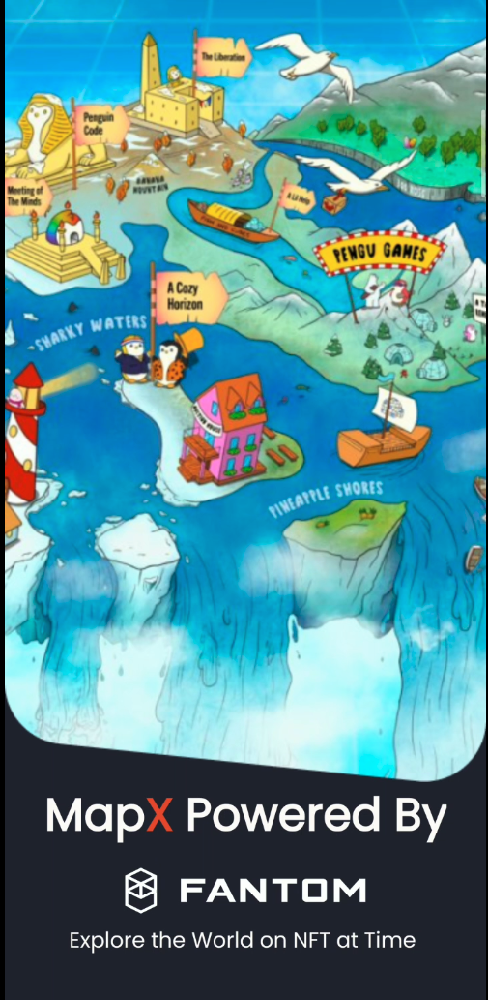

## Problem

1)Businesses often find it difficult to market themselves to drive foot traffic. According to the US Bureau of labour statistics ,traditional businesses find it hard to market themselves to consumers

a)About 20% of small businesses fail by the end of their First Year.

b)By the end of their fifth year, 50% go under;

c)And by the tenth year, that number rises to 80%

2)Traditional marketing methods have limitations such as high cost and being time-consuming. These problems can be solved

a)The outbreak of the COVID-19 pandemic has devastated businesses worldwide. These businesses include restaurants, theme parks as well as shopping malls. Prolonged lockdown and safe-distancing measures drastically decreased the foot traffic and revenue of these businesses, forcing them to shut down or pivot.

## Solution

A next-gen geo-tagged playground where players meet opportunities offered with a timeless technology. Map-based gameplay with capabilities to engage players and provide market visibility to enterprise.

1.The next generation of web building blocks are here — foster relationships between you and your customer .Tokenize your business offerings into a format that is hard to resist for your target group.

Pokemon Go has proven that it can flock people into places to "catch them all". Team Encrypt is aiming to offer businesses the exact same effec. Build communities by gathering people together.

Encrpyt mission is to be an NFT platform with real-life utilities. It seeks to encourage exploration and adventure

Collectable geo-tagged NFTs will be available around the neighbourhood, which players can redeem.

a)These NFTs can be in the form of vouchers from retail businesses such as restaurants, stores and theme parks, collectables such as limited edition digital pets as well as digital art.

b)This serves as a marketing tool for businesses to drive foot traffic while promoting health and wellness.

## Why Fantom

Fantom is a fast, high-throughput open-source smart contract platform for digital assets and dApps.
Why Fantom
Speed, security, scalability
Fantom’s aBFT consensus protocol delivers unparalleled speed, security, and reliability.
Enjoy almost instant transactions and extremely low fees.
• Almost instant transfers
Transactions on Fantom are finalized in a second and cost a fraction of a cent.
• Simply secure
Fantom’s validator nodes form a global, trustless, and leaderless Proof-of-Stake network.
• Highly scalable
Fantom can process thousands of transactions per seconds and scale to thousands of nodes.
• Ethereum compatible
Fantom is EVM compatible. Deploy and run your Ethereum dApps on Fantom.

## How to Install 
1) Download the apk file [MAPX](https://drive.google.com/file/d/1RwEGexPXcsOhKOIMxq-VxP0WsHPZkOId/view?usp=sharing) https://drive.google.com/file/d/1RwEGexPXcsOhKOIMxq-VxP0WsHPZkOId/view?usp=sharing and install in your android phone 

2) Catch all the NFTs

## Special thanks to Celo Team for their support 
